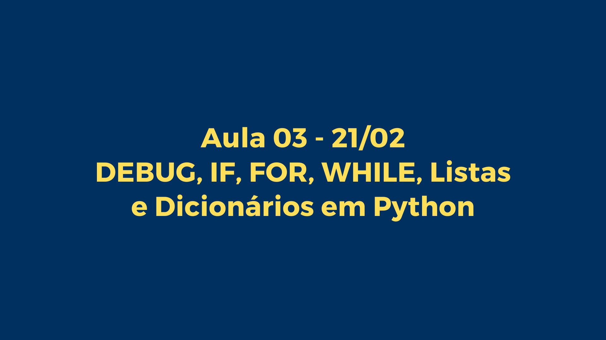
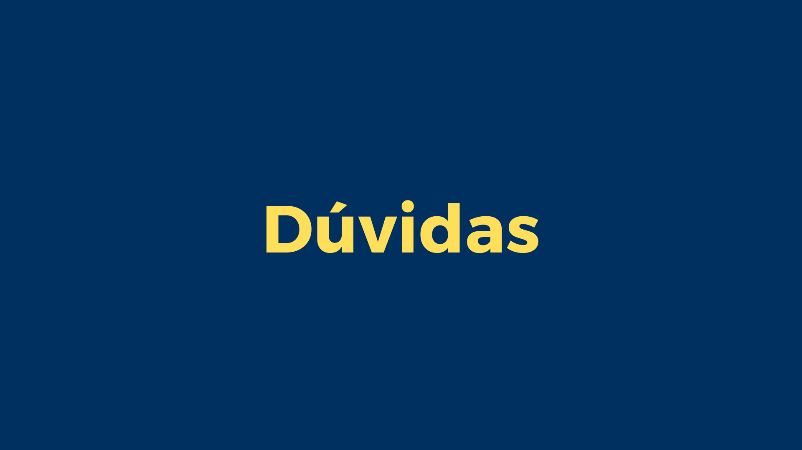

# Aula 03: IF, FOR, While, Listas e Dicionários em Python



Bem-vindo à terceira aula do bootcamp!

Hoje, vamos explorar estruturas de controle de fluxo como if, for, e while, além de mergulhar no mundo das listas e dicionários em Python. Esses conceitos são cruciais para a manipulação de dados e a construção de programas dinâmicos em Python, especialmente em campos como a engenharia de dados.

## Índice

1. **Introdução**
    * Importância das estruturas de controle de fluxo e coleções de dados.
2. **Estruturas de Controle de Fluxo**
    * IF: Condições e decisões.
    * FOR: Iterações em sequências.
    * WHILE: Loops com condições.
3. **Trabalhando com Listas**
    * Criação e manipulação de listas.
    * Métodos importantes de listas.
4. **Explorando Dicionários**
    * Criação e manipulação de dicionários.
    * Métodos importantes de dicionários.
5. **Desafio**
    * Aplicação de `if`, `for`, `while`, listas e dicionários em cenários de engenharia de dados.
6. **Dúdidas**
    * Modendo para retirar dúvidas

### Estruturas de Controle de Fluxo

Exploraremos como utilizar `if` para tomar decisões baseadas em condições, `for` para iterar sobre sequências de dados, e `while` para executar blocos de código enquanto uma condição for verdadeira.

### Trabalhando com Listas

Listas são coleções ordenadas e mutáveis que podem conter itens de diferentes tipos. São extremamente úteis para armazenar e manipular coleções de dados em Python.

### Explorando Dicionários

Dicionários armazenam pares de chave-valor e são ideais para representar dados de forma estruturada, permitindo acesso rápido a informações específicas.


## Estruturas de Controle de Fluxo

O if é uma estrutura condicional fundamental em Python que avalia se uma condição é verdadeira (True) e, se for, executa um bloco de código. Se a condição inicial não for verdadeira, você pode usar elif (else if) para verificar condições adicionais, e else para executar um bloco de código quando nenhuma das condições anteriores for verdadeira.

### Exercício 1: Verificação de Qualidade de Dados

Você está analisando um conjunto de dados de vendas e precisa garantir que todos os registros tenham valores positivos para `quantidade` e `preço`. Escreva um programa que verifique esses campos e imprima "Dados válidos" se ambos forem positivos ou "Dados inválidos" caso contrário.

```python
quantidade = 10  # Exemplo de valor, substitua com input do usuário se necessário
preço = 20  # Exemplo de valor, substitua com input do usuário se necessário

if quantidade > 0 and preço > 0:
    print("Dados válidos")
else:
    print("Dados inválidos")
```

### Exercício 2: Classificação de Dados de Sensor

Imagine que você está trabalhando com dados de sensores IoT. Os dados incluem medições de temperatura. Você precisa classificar cada leitura como 'Baixa', 'Normal' ou 'Alta'. Considerando que:

* Temperatura < 18°C é 'Baixa'
* Temperatura >= 18°C e <= 26°C é 'Normal'
* Temperatura > 26°C é 'Alta'

```python
temperatura = 22  # Exemplo de valor, substitua com input do usuário se necessário

if temperatura < 18:
    print("Baixa")
elif 18 <= temperatura <= 26:
    print("Normal")
else:
    print("Alta")
```

### Exercício 3: Filtragem de Logs por Severidade

Você está analisando logs de uma aplicação e precisa filtrar mensagens com severidade 'ERROR'. Dado um registro de log em formato de dicionário como `log = {'timestamp': '2021-06-23 10:00:00', 'level': 'ERROR', 'message': 'Falha na conexão'}`, escreva um programa que imprima a mensagem se a severidade for 'ERROR'.

```python
log = {'timestamp': '2021-06-23 10:00:00', 'level': 'ERROR', 'message': 'Falha na conexão'}

if log['level'] == 'ERROR':
    print(log['message'])
```

### Exercício 4: Validação de Dados de Entrada

Antes de processar os dados de usuários em um sistema de recomendação, você precisa garantir que cada usuário tenha idade entre 18 e 65 anos e tenha fornecido um email válido. Escreva um programa que valide essas condições e imprima "Dados de usuário válidos" ou o erro específico encontrado.

```python
idade = 25  # Exemplo de valor, substitua com input do usuário se necessário
email = "usuario@exemplo.com"  # Exemplo de valor, substitua com input do usuário se necessário

if not 18 <= idade <= 65:
    print("Idade fora do intervalo permitido")
elif "@" not in email or "." not in email:
    print("Email inválido")
else:
    print("Dados de usuário válidos")
```

### Exercício 5: Detecção de Anomalias em Dados de Transações

Você está trabalhando em um sistema de detecção de fraude e precisa identificar transações suspeitas. Uma transação é considerada suspeita se o valor for superior a R$ 10.000 ou se ocorrer fora do horário comercial (antes das 9h ou depois das 18h). Dada uma transação como `transacao = {'valor': 12000, 'hora': 20}`, verifique se ela é suspeita.

```python
transacao = {'valor': 12000, 'hora': 20}

if transacao['valor'] > 10000 or transacao['hora'] < 9 or transacao['hora'] > 18:
    print("Transação suspeita")
else:
    print("Transação normal")
```

### FOR

O loop `for` é utilizado para iterar sobre os itens de qualquer sequência, como listas, strings, ou objetos de dicionário, e executar um bloco de código para cada item. É especialmente útil quando você precisa executar uma operação para cada elemento de uma coleção.

#### 6. Contagem de Palavras em Textos

**Objetivo:** Dado um texto, contar quantas vezes cada palavra única aparece nele.

```python
texto = "a raposa marrom salta sobre o cachorro preguiçoso"
palavras = texto.split()
contagem_palavras = {}

for palavra in palavras:
    if palavra in contagem_palavras:
        contagem_palavras[palavra] += 1
    else:
        contagem_palavras[palavra] = 1

print(contagem_palavras)
```

#### 7. Normalização de Dados

**Objetivo:** Normalizar uma lista de números para que fiquem na escala de 0 a 1.

```python
numeros = [10, 20, 30, 40, 50]
minimo = min(numeros)
maximo = max(numeros)
normalizados = [(x - minimo) / (maximo - minimo) for x in numeros]

print(normalizados)
```

#### 8. Filtragem de Dados Faltantes

**Objetivo:** Dada uma lista de dicionários representando dados de usuários, filtrar aqueles que têm um campo específico faltando.

```python
usuarios = [
    {"nome": "Alice", "email": "alice@example.com"},
    {"nome": "Bob", "email": ""},
    {"nome": "Carol", "email": "carol@example.com"}
]

usuarios_validos = [usuario for usuario in usuarios if usuario["email"]]

print(usuarios_validos)
```

#### 9. Extração de Subconjuntos de Dados

**Objetivo:** Dada uma lista de números, extrair apenas aqueles que são pares.

```python
numeros = range(1, 11)
pares = [x for x in numeros if x % 2 == 0]

print(pares)
```

#### 10. Agregação de Dados por Categoria

**Objetivo:** Dado um conjunto de registros de vendas, calcular o total de vendas por categoria.

```python
vendas = [
    {"categoria": "eletrônicos", "valor": 1200},
    {"categoria": "livros", "valor": 200},
    {"categoria": "eletrônicos", "valor": 800}
]

total_por_categoria = {}
for venda in vendas:
    categoria = venda["categoria"]
    valor = venda["valor"]
    if categoria in total_por_categoria:
        total_por_categoria[categoria] += valor
    else:
        total_por_categoria[categoria] = valor

print(total_por_categoria)
```

### Exercícios com WHILE

#### 11. Leitura de Dados até Flag

**Objetivo:** Ler dados de entrada até que uma palavra-chave específica ("sair") seja fornecida.

```python
dados = []
entrada = ""
while entrada.lower() != "sair":
    entrada = input("Digite um valor (ou 'sair' para terminar): ")
    if entrada.lower() != "sair":
```

#### 12. Validação de Entrada

**Objetivo:** Solicitar ao usuário um número dentro de um intervalo específico até que a entrada seja válida.

```python
numero = int(input("Digite um número entre 1 e 10: "))
while numero < 1 or numero > 10:
    print("Número fora do intervalo!")
    numero = int(input("Por favor, digite um número entre 1 e 10: "))

print("Número válido!")
```

#### 13. Consumo de API Simulado

**Objetivo:** Simular o consumo de uma API paginada, onde cada "página" de dados é processada em loop até que não haja mais páginas.

```python
pagina_atual = 1
paginas_totais = 5  # Simulação, na prática, isso viria da API

while pagina_atual <= paginas_totais:
    print(f"Processando página {pagina_atual} de {paginas_totais}")
    # Aqui iria o código para processar os dados da página
    pagina_atual += 1

print("Todas as páginas foram processadas.")
```

#### 14. Tentativas de Conexão

**Objetivo:** Simular tentativas de reconexão a um serviço com um limite máximo de tentativas.

```python
tentativas_maximas = 5
tentativa = 1

while tentativa <= tentativas_maximas:
    print(f"Tentativa {tentativa} de {tentativas_maximas}")
    # Simulação de uma tentativa de conexão
    # Aqui iria o código para tentar conectar
    if True:  # Suponha que a conexão foi bem-sucedida
        print("Conexão bem-sucedida!")
        break
    tentativa += 1
else:
    print("Falha ao conectar após várias tentativas.")
```

#### 15. Processamento de Dados com Condição de Parada

**Objetivo:** Processar itens de uma lista até encontrar um valor específico que indica a parada.

```python
itens = [1, 2, 3, "parar", 4, 5]

i = 0
while i < len(itens):
    if itens[i] == "parar":
        print("Parada encontrada, encerrando o processamento.")
        break
    # Processa o item
    print(f"Processando item: {itens[i]}")
    i += 1
```
## Estruturas de Controle de Fluxo

### Exercícios com Listas

#### 16. Eliminação de Duplicatas

**Objetivo:** Dada uma lista de emails, remover todos os duplicados.

```python
emails = ["user@example.com", "admin@example.com", "user@example.com", "manager@example.com"]
emails_unicos = list(set(emails))

print(emails_unicos)
```

#### 17. Filtragem de Dados

**Objetivo:** Dada uma lista de idades, filtrar apenas aquelas que são maiores ou iguais a 18.

```python
idades = [22, 15, 30, 17, 18]
idades_validas = [idade for idade in idades if idade >= 18]

print(idades_validas)
```

#### 18. Ordenação Personalizada

**Objetivo:** Dada uma lista de dicionários representando pessoas, ordená-las pelo nome.

```python
pessoas = [
    {"nome": "Alice", "idade": 30},
    {"nome": "Bob", "idade": 25},
    {"nome": "Carol", "idade": 20}
]
pessoas.sort(key=lambda pessoa: pessoa["nome"])

print(pessoas)
```

#### 19. Agregação de Dados

**Objetivo:** Dado um conjunto de números, calcular a média.

```python
numeros = [10, 20, 30, 40, 50]
media = sum(numeros) / len(numeros)

print("Média:", media)
```

#### 20. Divisão de Dados em Grupos

**Objetivo:** Dada uma lista de valores, dividir em duas listas: uma para valores pares e outra para ímpares.

```python
valores = [1, 2, 3, 4, 5, 6, 7, 8, 9, 10]
pares = [valor for valor in valores if valor % 2 == 0]
impares = [valor for valor in valores if valor % 2 != 0]

print("Pares:", pares)
print("Ímpares:", impares)
```

### Exercícios com Dicionários

#### 21. Atualização de Dados

**Objetivo:** Dada uma lista de dicionários representando produtos, atualizar o preço de um produto específico.

```python
produtos = [
    {"id": 1, "nome": "Teclado", "preço": 100},
    {"id": 2, "nome": "Mouse", "preço": 80},
    {"id": 3, "nome": "Monitor", "preço": 300}
]

# Atualizar o preço do produto com id 2 para 90
for produto in produtos:
    if produto["id"] == 2:
        produto["preço"] = 90

print(produtos)
```

#### 22. Fusão de Dicionários

**Objetivo:** Dados dois dicionários, fundi-los em um único dicionário.

```python
dicionario1 = {"a": 1, "b": 2}
dicionario2 = {"c": 3, "d": 4}

dicionario_fundido = {**dicionario1, **dicionario2}

print(dicionario_fundido)
```

#### 23. Filtragem de Dados em Dicionário

**Objetivo:** Dado um dicionário de estoque de produtos, filtrar aqueles com quantidade maior que 0.

```python
estoque = {"Teclado": 10, "Mouse": 0, "Monitor": 3, "CPU": 0}

estoque_positivo = {produto: quantidade for produto, quantidade in estoque.items() if quantidade > 0}

print(estoque_positivo)
```

#### 24. Extração de Chaves e Valores

**Objetivo:** Dado um dicionário, criar listas separadas para suas chaves e valores.

```python
dicionario = {"a": 1, "b": 2, "c": 3}
chaves = list(dicionario.keys())
valores = list(dicionario.values())

print("Chaves:", chaves)
print("Valores:", valores)
```

#### 25. Contagem de Frequência de Itens

**Objetivo:** Dada uma string, contar a frequência de cada caractere usando um dicionário.

```python
texto = "engenharia de dados"
frequencia = {}

for caractere in texto:
    if caractere in frequencia:
        frequencia[caractere] += 1
    else:
        frequencia[caractere] = 1

print(frequencia)
```



